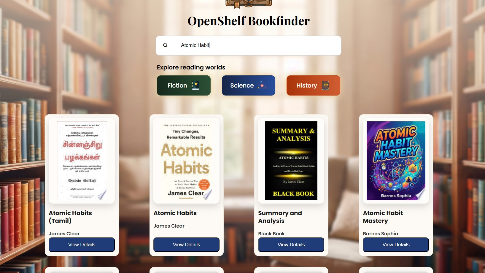

# 📚 OpenShelf – Book Finder

OpenShelf is a modern book discovery web application that helps users search and explore books using the Google Books API. It provides detailed information such as book covers, authors, ratings, publication details, descriptions, and direct preview links through a clean and responsive user interface.

## 🌐 Live Demo

🔗 https://sujeet0910.github.io/OpenShelf-BookFinder/

## 📸 Preview



---

## ✨ Features

- 🔍 Search books by title, author, or keyword
- 📖 Real-time data fetched using Google Books API
- 🖼️ Displays book cover, title, author, and publication year
- ⭐ Additional book information
- 📚 Detailed modal with complete book description
- 🔗 Direct preview/read link (when available)
- 🌙 Dark-themed interface
- ⚡ Fast and interactive user experience
- 📱 Mobile-friendly responsive layout
- ❌ User-friendly error handling for invalid searches and API failures

---

## 🛠️ Built With

- HTML5
- CSS3
- JavaScript (ES6)
- Google Books API

---

## 📂 Project Structure

```
OpenShelf-BookFinder/
│
├── index.html
├── css/
│   └── style.css
├── js/
│   └── script.js
├── assets/
│   ├── images/
│   └── icons/
|---Screenshots/
└── README.md
```
## 🔗 API Used

Google Books API

## 💡 Future Improvements

- User authentication
- Wishlist / Favorites
- Book categories
- Advanced filters
- Pagination
- Voice search
- Recently searched books
- Reading history
- Light/Dark mode toggle
  
---

## 👨‍💻 Author

**Sujeet Rajpoot**

GitHub: https://github.com/sujeet0910
---

## ⭐ Support

If you found this project useful, consider giving it a ⭐ on GitHub.
